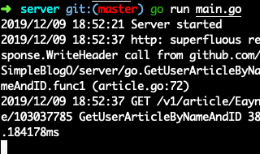

# Simple Blog

成员：

* 马易颜 17343085
* 林国梁 17343073

## 目录

* [项目介绍](#项目介绍)
* [后端安装与启动](#后端安装与启动)
* [API风格](#API风格)
* [资源](#资源)
* [数据来源](#数据来源)
* [API说明](#API说明)
* [API使用示例](#API使用示例)
* [OpenAPI设计](#OpenAPI)
* [Swagger-editor+Swagger-UI](#Swagger-editor+Swagger-UI)
* [ Swagger-codegen](#Swagger-codegen)

### 项目介绍

该项目简单的设计了一个博客网站的前端与后端，所用到的技术与思想包括：

* **API FIRST**：先创建博客服务与外部交互的文档API，然后再根据API来开发代码
* **REST** 风格API
* **Open API specification**：利用yaml规格完成API的具体设计
* **Swagger editor + Swagger UI**：利用Swagger的web editor将设计的API 可视化
* **Swagger codegen**：根据设计好的Open API 自动创建go-server与javascript client
* **boltDB**： 采用基于key-value存储的数据库高效存取数据
* **JSON**：基于json的数据存储与传输
* **Easy-mock**：测试服务端API的在线mock测试工具

### 后端安装与启动

* 安装仓库：

  `git clone git@github.com:SimpleBlogO/server.git`

* 启动项目:

  `$server : go run main.go`

  注意必须要在`server`目录下启动，这样服务器才会使用该文件夹下的`smo.db`，该数据库已经装好了来自csdn博客的真实数据。

  项目启动后会在`localhost:8080`端口启动服务器监听，并且会在终端自动记录相关的访问服务。

  

  

### API风格

* `REST`风格

* `base URL : 127.0.0.1:8080/v1`
* 传输格式：`JSON`
* 协议：`HTTPS`

### 资源

* user：用户(API数：6个)
* column：用户的专栏(API数：1个)
* article：用户的文章(API数：2个)
* review：文章的评论(API数：1个)

### 数据来源

来自于`CSDN`的用户[Eayne](https://me.csdn.net/blog/Eayne)以及[pmlpml](https://me.csdn.net/blog/pmlpml)

通过简单的网页爬取后按照json格式存储在了`server`仓库的`data`中

* article：四篇

  来自于`Eayne`用户的文章

  * [gzip源代码阅读与分析](https://blog.csdn.net/Eayne/article/details/103037785)
  * [go的web应用开发](https://blog.csdn.net/Eayne/article/details/102892431)
  * [go与git知识](https://blog.csdn.net/Eayne/article/details/102632898)
  * [selpg总结](https://blog.csdn.net/Eayne/article/details/102023781)

* column：6个

  来自于[pmlpml](https://me.csdn.net/column/pmlpml)用户的专栏：

  * [linux&CentOS7](https://blog.csdn.net/pmlpml/category_6263790.html)
  * [java和&Spring](https://blog.csdn.net/pmlpml/category_6514096.html)
  * [docker](https://blog.csdn.net/pmlpml/category_6568857.html)
  * [微服务](https://blog.csdn.net/pmlpml/category_6537821.html)
  * [Unity 3D](https://blog.csdn.net/pmlpml/category_6920860.html)
  * [Golang](https://blog.csdn.net/pmlpml/category_7245009.html)

* review：4个

  来自于[pmlpml](https://me.csdn.net/blog/pmlpml)

  [Java Reactive 异步与并发编程](https://blog.csdn.net/pmlpml/article/details/70470416)的两条评论

  [使用 Spring缓存抽象 支持 EhCache 和 Redis 混合部署](https://blog.csdn.net/pmlpml/article/details/53116377)的两条评论

* user：4个

  属于我们自己创建的4个账户，由于涉及到密码，因此在这不便说明，且账号信息已经直接写入到数据库中(而没有保存在)

### API说明

* `user`对用户的基本操作

  * 创建用户：

    * `POST /user`
    * query参数：

    | 名称       | 类型   | 解释     |
    | ---------- | ------ | -------- |
    | username   | string | 用户名称 |
    | email      | string | 邮箱     |
    | phone      | string | 电话     |
    | password   | string | 密码     |
    | userStatus | String | 用户状态 |

    * 响应：

      | Code | Description            |
      | ---- | ---------------------- |
      | 200  | successful operation   |
      | 400  | username has been used |
      | 500  | internal server error  |

  * 用户登录：

    * `GET /user/login`
    * query参数:

    | 名称     | 类型   | 解释     |
    | -------- | ------ | -------- |
    | username | string | 用户名称 |
    | password | string | 密码     |

    * 响应：

      | Code | Description                        |
      | ---- | ---------------------------------- |
      | 200  | successful operation               |
      | 400  | Invalid username/password supplied |
      | 500  | internal server error              |

  * 用户登出：

    * `GET /user/logout`

    * 响应：

      | Code    | Description          |
      | ------- | -------------------- |
      | default | successful operation |

  * 获取用户名称

    * `GET /user/{username}`

    * 响应：

      | Code | Description                                                  |
      | ---- | ------------------------------------------------------------ |
      | 200  | successful operation   `{   "username": "string",   "email": "string",   "password": "string",   "phone": "string",   "userStatus": 0 }` |
      | 404  | user not found                                               |
      | 500  | internal server error                                        |

  * 更新用户信息：

    * `PUT /user/{username}`

    * query参数：

      | 名称           | 类型   | 解释                                                         |
      | -------------- | ------ | ------------------------------------------------------------ |
      | username(path) | string | 需要修改用户的名称                                           |
      | body           | model  | 修改后的信息。如：`{   "username": "string",   "email": "string",   "password": "string",   "phone": "string",   "userStatus": 0 }` |

    * 响应：

      | Code | Description           |
      | ---- | --------------------- |
      | 404  | User not found        |
      | 500  | internal server error |

  * 删除用户：

    * `DELETE /user/{username}`

    * query参数：

      | 名称           | 类型   | 解释               |
      | -------------- | ------ | ------------------ |
      | username(path) | string | 需要修改用户的名称 |

    * 响应：

      | Code | Description           |
      | ---- | --------------------- |
      | 200  | successful operation  |
      | 404  | user not found        |
      | 500  | internal server error |

* `column`：用户所拥有的专栏

  * 获取所有专栏名称

    * `GET /column/{username}`

    * query参数：

      | 名称           | 类型   | 解释       |
      | -------------- | ------ | ---------- |
      | username(path) | string | 用户的名称 |

    * 响应：

      | Code | Description                                                  |
      | ---- | ------------------------------------------------------------ |
      | 200  | successful operation`{   "columnName": [     "string"   ] }` |
      | 404  | User not found                                               |
      | 500  | internal server error                                        |

* `article`：用户发表的文章

  * 获取用户所有文章

    * `GET /article/{username}`

    * query参数：

      | 名称           | 类型   | 解释       |
      | -------------- | ------ | ---------- |
      | username(path) | string | 用户的名称 |

    * 响应：

      | Code | Description                                                  |
      | ---- | ------------------------------------------------------------ |
      | 200  | successful operation`[   {     "id": "string",     "title": "string",     "author": "string",     "content": "string"   } ]` |
      | 404  | User not found                                               |
      | 500  | internal server error                                        |

  * 获取用户指定文章

    * `GET /article/{username}/{id}`

    * query参数：

      | 名称           | 类型   | 解释     |
      | -------------- | ------ | -------- |
      | username(path) | string | 用户名称 |
      | id(path)       | string | 文章ID   |

    * 响应：

      | Code | Description                                                  |
      | ---- | ------------------------------------------------------------ |
      | 200  | successful operation`{   "id": "string",   "title": "string",   "author": "string",   "content": "string" }` |
      | 404  | Article not found                                            |
      | 500  | internal server error                                        |

* `review`

  * 获取指定文章下的所有评论

    * `GET /review/{username}/{id}`

    * query参数：

      | 名称           | 类型   | 解释     |
      | -------------- | ------ | -------- |
      | username(path) | string | 用户名称 |
      | id(path)       | string | 文章ID   |

    * 响应：

      | Code | Description                                                  |
      | ---- | ------------------------------------------------------------ |
      | 200  | successful operation`{   "comments": [     {       "content": "string"     }   ] }` |
      | 404  | Article not found                                            |
      | 500  | internal server error                                        |

### API使用示例

这里用`curl`展示两个API使用的示例：

* 创建用户：

  `curl localhost:8080/v1/user -X POST  -d 'username=12312312345&email=123&password=123&phone=23&userStatus=123'`

  这里向服务器url发送POST请求，然后将指定的用户信息参数填入后发送请求。

  如下为正确创建成功后的响应(200)：

  

  当用户信息已经存在的时候，创建失败的响应(400)：

  

* 查询用户信息：

  `curl localhost:8080/v1/user/12312312345 -i`

  这里向服务器url发送get 请求，指定了用户的名称。

  如下为获取的响应内容(200)：

  

  当查询一个不存在的用户的时候的响应(400)：
  

### OpenAPI

基本的设计已经包含在`swagger.json`(`swagger.yaml`)文件中。其中按照yaml/json格式完成REST API的设计。下面是部分设计的部分API：

### Swagger-editor+Swagger-UI

通过在线的[Swagger web editor](https://swagger.io/tools/swagger-editor/f)进入到**live demo**后，导入`swagger.yaml`即可将API可视化，并在线编辑：

###Swagger-codegen

该工具可以利用写好的API yaml文件自动创建多种语言的server和client模版，简化开发流程。

* 依赖：java 8以上

* 通过`Wget https://oss.sonatype.org/content/repositories/releases/io/swagger/swagger-codegen-cli/2.2.1/swagger-codegen-cli-2.2.1.jar`下载
* `java -jar swagger-codegen-cli-2.2.1.jar generate -i swagger.json -l go-server`可以创建对应API的go-server
* `java -jar swagger-codegen-cli-2.2.1.jar generate -i swagger.json -l javascript`可以创建对应API的javascript client

